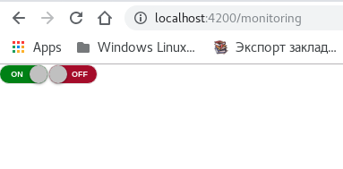
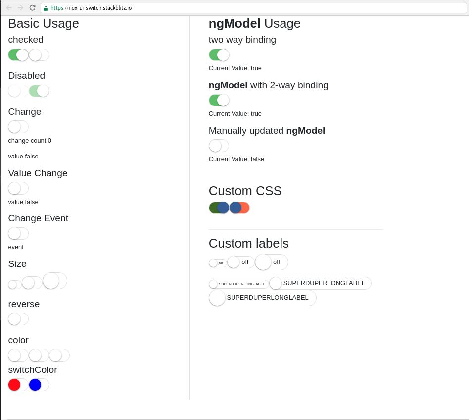

# Slide Toggle component for Angular (ngx ui switch)

* [ngx-slide-toggle](https://www.npmjs.com/package/ngx-slide-toggle)
    * [ngx-ui-switch](https://www.npmjs.com/package/ngx-ui-switch)
* [Repo + Demo](https://stackblitz.com/edit/ngx-ui-switch) `https://stackblitz.com/edit/ngx-ui-switch`
* [ngx ui switch Documentation](https://webcat12345.github.io/ngx-ui-switch/demo) `https://webcat12345.github.io/ngx-ui-switch/demo`
    * [webcat12345 * ngx-ui-switch](https://github.com/webcat12345/ngx-ui-switch)
    * [harunurhan * ng2-slide-toggle](https://github.com/harunurhan/ng2-slide-toggle)
        * [ng2-slide-toggle](https://www.npmjs.com/package/ng2-slide-toggle)

